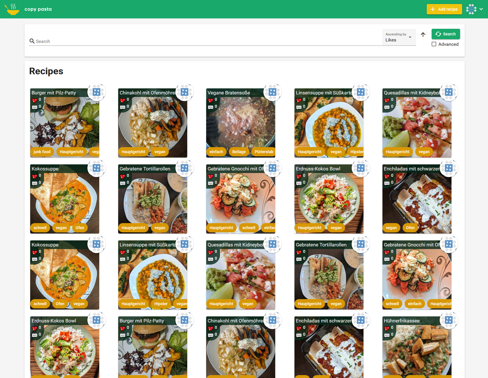
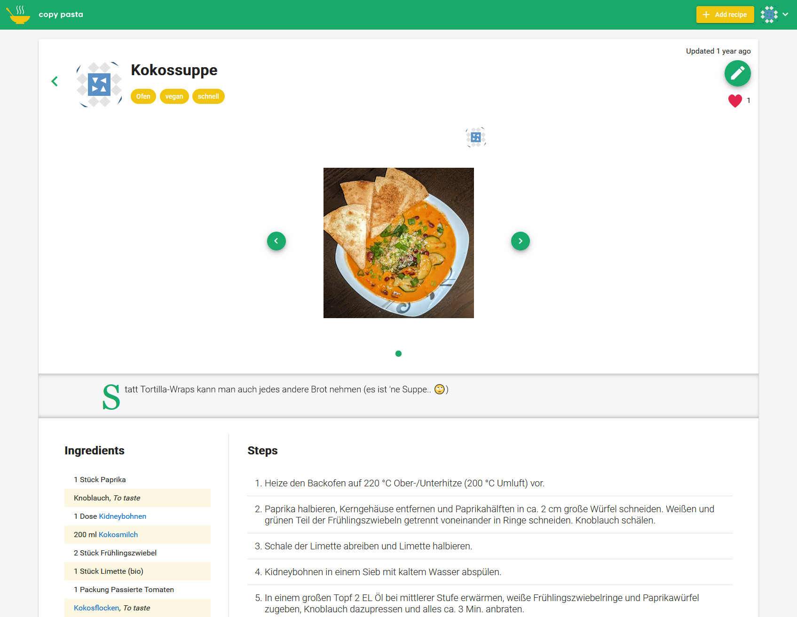
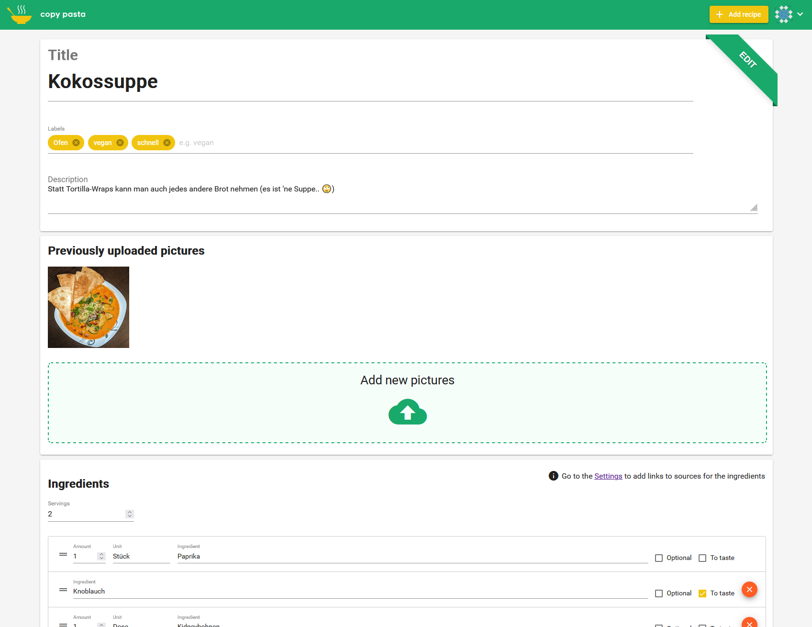

# copy-pasta
Built with [Spring Boot](https://spring.io/) and [Angular](https://angular.io/)

Filter and sort all recipes

View recipe (mobile-friendly - perfect for cooking)

Edit or add recipe

## Running locally
### Database
- Spin up any SQL database (tested with PostgreSQL and MySQL)
### Backend
- Set environment variables:
   - JDBC_DATABASE_URL=jdbc:postgresql://localhost:5432/copy-pasta
   - JDBC_DATABASE_USERNAME=copy-pasta-user
   - JDBC_DATABASE_PASSWORD=secret_pw
   - FRONTENDURL=http://localhost:4200
   - PICPATH=C:\dev\copy-pasta\pics
   - JWTSECRET=mustBeAtLeastBe32CharactersLong
   - PORT=8080
   - ACCESS_TOKEN_EXPIRE_MINUTES=180
   - REFRESH_TOKEN_EXPIRE_DAYS=30
- Run with ".\gradlew.bat bootRun"
### UI
- Make sure backend is already running
- Run `npm start` for a dev server. Navigate to `http://localhost:4200/`
- Initial username/password on empty DB is 'initialChangeMe'